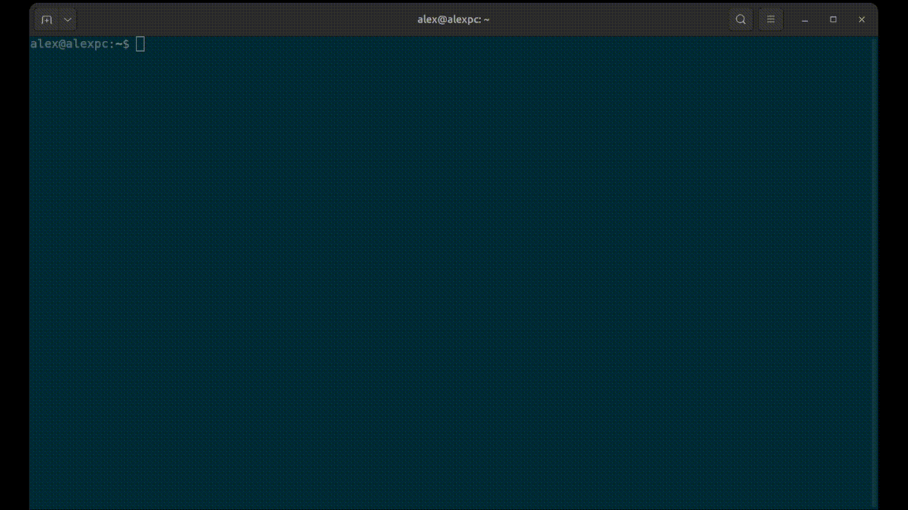

# RadeonStats
Simple TUI tool for monitoring your AMD Radeon GPU on Linux

## Building
Run `gradlew shadowJar` to generate a JAR file with all dependencies included.
The file will be located in `build/libs/`.

## Runtime Dependencies
Linux & Radeon:
- `lspci`
- `radeontop`
- `sensors`